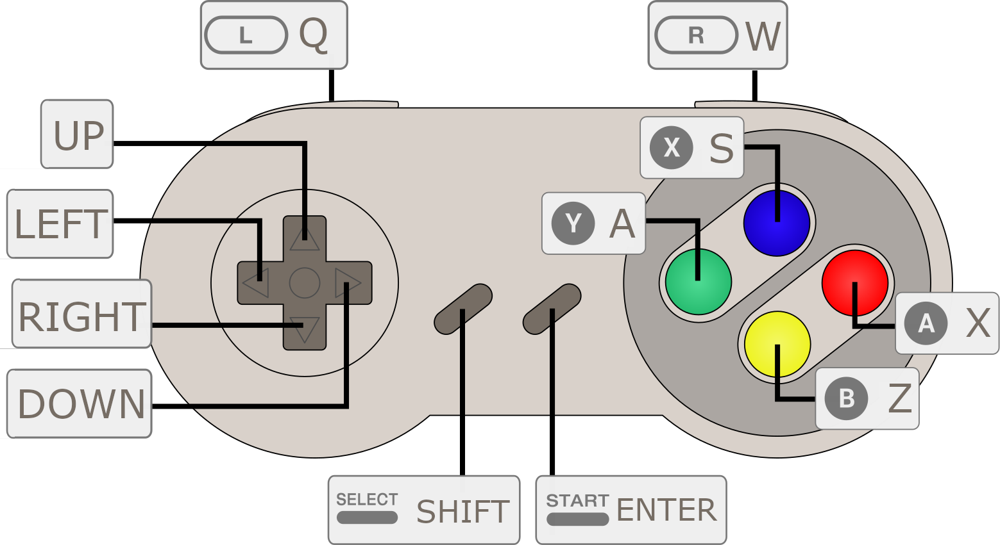

This is a cross-platform joystick-driven music-tracker.

It uses [CLAP](https://github.com/free-audio/clap) for sound-generation and effects, which you can sequence. This allows a wide variety of instrument-types, from the same interface.

## installation

Grab [the latest release](https://github.com/konsumer/raypoketrack/releases) for your platform. On steamdeck, I made a non-steam game launcher. Joystick (analog/dpad/etc) worked for me without any config, but since SELECT is next to dpad, I also added controller-maps so triggers act as START/SELECT (on opposite sides) which allows for easier SELECT + dpad. In launch options, add `--fullscreen`.

I don't have mobile builds setup yet, but it should work OK on the web:

<a href="https://konsumer.js.org/raypoketrack/">
 
</a>

## usage

You should be able to track quickly with a joystick, or keys:



It may seem a bit inscrutable at first, but input is meant to be consistent and fast with a joystick, so once you get the hang of it, it should work well. A is "edit/change value", B is "delete/reset/cancel", X is "fill column", Y is "clear column", SELECT + arrow is "change screen", and START is "play song/pattern".


**Any screen**

| Input | Purpose |
|---|---|
| SELECT + ←/↑/↓/→ | Switch to Song / Pattern / Instrument / Menu |
| START | Play/stop song |

**Song**

| Input | Purpose |
|---|---|
| ↑/↓ | Move cursor row |
| ←/→ | Scroll channels |
| A + ↑/↓ | Set pattern number in cell |
| B | Clear cell |

**Pattern**

| Input | Purpose |
|---|---|
| L / R | Previous / next pattern |
| ↑/↓ | Move cursor row |
| ←/→ | Move cursor column (note → vel → inst → fx…) |
| X / Y | Fill / clear entire column |
| START | Loop current pattern (not full song) |
| B | Clear cell |
| A + ↑/↓ | Set node/param number in cell |
| A + B | OFF or instrument-stop |

**Instrument**

| Input | Purpose |
|---|---|
| L / R | Previous / next instrument |
| ↑/↓ | Navigate slots / params |
| → / ← | Enter / leave param panel |
| A + ↑/↓ | Cycle unit type (slot) · Change value ±1 (param) |
| A + ←/→ | Change value ±16 (param) |
| A + B | Toggle slot enabled/disabled |
| A | Open file picker (FILE row) |
| B | Clear slot / reset param / clear file path |

**Menu**

| Input | Purpose |
|---|---|
| ↑/↓ | Navigate items |
| A + ↑/↓ | Change value ±1 (BPM / KEY / SCALE) |
| A + ←/→ | Change BPM ±10 |
| A | Confirm action |

Here are some videos:

[](https://www.youtube.com/playlist?list=PLDE2Ywpu1J__p2yBXrMOoKCgtIYQgfGo7)

### plugins

There are some built-in units (effects/sound-generators) but you can also use CLAP plugins.

**Instruments**
- [Surge XT](https://surge-synthesizer.github.io/) — subtractive/wavetable synth; good first test
- [Vital](https://vital.audio/) — wavetable synth, free tier
- [Dexed](https://asb2m10.github.io/dexed/) — DX7 FM emulation
- [OB-Xd](https://www.discodsp.com/obxd/) — Oberheim-style analog

**Effects**
- [Airwindows](https://www.airwindows.com/) — large collection of free DSP effects
- [Dragonfly Reverb](https://michaelwillis.github.io/dragonfly-reverb/) — room/hall/plate reverbs

**CLAP lands at:**
- macOS:  `/Library/Audio/Plug-Ins/CLAP/*.clap`
- Windows: `C:\Program Files\Common Files\CLAP\*.clap`
- Linux: `/usr/lib/clap/*.clap`


They can be pretty confusing, since the original GUI is missing, and that is generally how these plugins were designed to be used, but it's doable. Here is an example test with "Surge XT":

map these params:

- 319 (cutoff)
- 320 (resonance)
- 317 (filter type)

set resonance high, and filter-type to 10 hex (lowpass)

Pattern would look like:

 ```
C-4  00  00 80
---  00  00 90
---  00  00 A0
---  00  00 B0
```

which sequences cutoff.

On linux, this didn't seem to work for me, but neither did the official Surge XT standalone (could not change reso/cut.) I did test linux with a simple CLAP plugin, so I think it's an issue with Surge XT.

## development

I use `make` to record common tasks (and `cmake` to actually build) so you can run `make` to get documentation.

## todo

- simple set of cross-platform single-purpose CLAP plugins
- [WebCLAP](https://github.com/WebCLAP/) support for web & native
- "bundle" a save for distribution, that creates a zip with song + all referenced files


